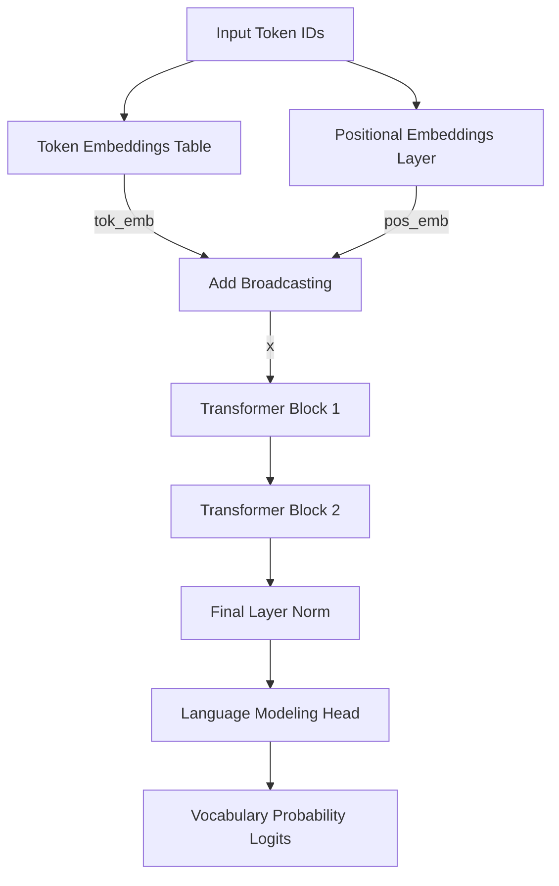

# Project Report: Mini Code LLM Model Architecture & Implementation
**A custom character-level Decoder-only Generative Pre-trained Transformer (GPT) implemented from scratch in PyTorch.**

---

## 1. Architectural Overview

The **Mini Code LLM** is a decoder-only, autoregressive language model designed to generate Python programs from natural language instructions. It compiles custom embeddings, multi-head self-attention mechanisms, and feed-forward networks into a functional, pre-trained transformer stack.

### Model Configuration Summary

| Hyperparameter | Value | Description |
| :--- | :--- | :--- |
| **Embedding Dimension (\(d_{\text{model}}\))** | 64 | Dimension of token and positional vectors |
| **Context Length (\(T\))** | 128 / 256 | Context window size (128 for training, 256 max) |
| **Decoder Blocks (\(N\))** | 2 | Stack depth of Transformer Blocks |
| **Attention Heads (\(h\))** | 4 | Number of parallel attention heads |
| **Head Dimension (\(d_k\))** | 16 | Projection dimension per head (\(64 / 4 = 16\)) |
| **Model Size** | ~2.6 MB | Saved PyTorch weights file size |

---

## 2. Component Analysis

### A. Vocabulary & Tokenization (`tokenizer.py`)
The model uses a character-level vocabulary built deterministically from the training corpus.
*   **Vocabulary Extraction:** Unique characters are extracted and sorted to build mapping dictionaries:
    *   `stoi` (String-to-Index) mapping character strings to unique integers.
    *   `itos` (Index-to-String) mapping integers back to characters.
*   **Autoregressive Properties:** Encoding maps strings into a 1D sequence of integers, and decoding maps integer tensors back into human-readable text.

---

### B. Dataset & Context Slicing (`dataset.py`)
Loads text from the training dataset file (`code_dataset.txt`) and structures it for next-token prediction:
*   **Autoregressive Shift:** For any start index `idx`, it extracts:
    *   **Inputs (\(X\)):** Slices from `idx` to `idx + context_len`.
    *   **Targets (\(Y\)):** Slices from `idx + 1` to `idx + context_len + 1`.
*   This target shifting ensures that at each sequence position, the model is trained to predict the character that immediately follows the input context.

---

### C. Positional Embedding Layer (`positional_embedding.py`)
Since self-attention is permutation-invariant, positional coordinates must be injected to capture word order:
*   Uses a learned or sinusodially-derived embedding layer of shape `(max_seq_len, embedding_dim)`.
*   During forward passes, token embeddings and position embeddings are combined via broadcasting addition:
    \[x = \text{tok\_emb} + \text{pos\_emb}\]

---

### D. Single-Head Causal Self-Attention (`self_attention.py`)
Computes Scaled Dot-Product Attention:
1.  **Linear Projections:** Input \(X\) is projected into Query (\(Q\)), Key (\(K\)), and Value (\(V\)) matrices:
    \[Q = XW_Q, \quad K = XW_K, \quad V = XW_V\]
2.  **Affinity Calculation:** Raw scores are scaled by the square root of the head dimension to prevent vanishing gradients:
    \[\text{Scores} = \frac{QK^T}{\sqrt{d_k}}\]
3.  **Causal Masking:** A lower-triangular matrix (`tril`) filters future tokens. Future positions are set to \(-\infty\):
    \[\text{Masked Scores}_{i, j} = -\infty \quad \text{for } j > i\]
4.  **Softmax Activation:** Generates attention weights:
    \[\text{Attention Weights} = \text{softmax}(\text{Masked Scores})\]
5.  **Weighted Value Sum:** Outputs vector representations:
    \[\text{Output} = \text{Attention Weights} \times V\]

---

### E. Multi-Head Attention (`multi_head_attention.py`)
Runs multiple attention heads in parallel to focus on different information channels:
*   Instantiates \(h = 4\) independent `SelfAttention` heads.
*   The output of each head is concatenated along the channel dimension, transforming shape from \(4 \times (B, T, 16)\) back to \((B, T, 64)\).
*   Applies a final linear projection layer to merge head features and perform dropout.

---

### F. Feed-Forward Network (`feed_forward.py`)
A multi-layer perceptron applied to each token vector independently:
1.  **Projection Up:** Projects embedding dimension up (e.g. \(64 \rightarrow 256\)).
2.  **Activation:** Applies non-linear activation (typically ReLU or GELU).
3.  **Projection Down:** Projects dimensions back down to the model size (\(256 \rightarrow 64\)).
4.  **Dropout:** Controls model overfitting.

---

### G. Transformer Block Assembly (`transformer_block.py`)
Combines multi-head attention and feed-forward networks using skip connections and normalization layers:
*   **Pre-LN Design:** Normalizations are applied *before* entering the attention and feed-forward layers:
    \[x_1 = x + \text{MultiHeadAttention}(\text{LayerNorm}(x))\]
    \[x_2 = x_1 + \text{FeedForward}(\text{LayerNorm}(x_1))\]
*   **Residual Connections:** Additive shortcuts retain original representations, preventing gradient decay across deep neural layers.

---

### H. Complete Model Orchestrator (`mini_gpt.py`)
Assembles all modules into a unified class subclassing `nn.Module`:
1.  Loads positional embeddings and stacks \(N = 2\) Transformer Decoder Blocks.
2.  Processes input token ids into predictions.
3.  **Language Modeling Head:** Projects final normalized activations \((B, T, 64)\) back to vocabulary scores \((B, T, \text{vocab\_size})\).
4.  **Cross-Entropy Loss:** Computes categorical cross-entropy when training targets are supplied.

---

## 3. Training and Generation

### A. Training Loop (`train.py`)
Runs optimization sweeps over the training dataset:
*   **Optimizer:** AdamW with a learning rate of \(1 \times 10^{-3}\) (0.001).
*   **Batching:** Batch size of 4 with sequence length 128.
*   **Epochs:** Trained for 50 epochs, tracking average loss trends.
*   **Weight Serialization:** Outputs the state dictionary parameters as a `.pth` file (`mini_gpt_model.pth`).

### B. Generative Sampling (`generate.py`)
Implements autoregressive, next-character code generation:
1.  **Prompt Ingestion:** Encodes input prompts (e.g. *"Instruction: Write a function to double a number\n\nCode:\n"*).
2.  **Logits Inference:** Passes the sequence to the model and extracts predictions for the last token.
3.  **Temperature Scaling:** Divides logits by a temperature value (e.g., \(0.8\)) to control creativity vs. determinism.
4.  **Top-K Filtering:** Keeps only the top \(k=5\) most probable characters, setting the rest to \(-\infty\) to filter out garbage outputs.
5.  **Multinomial Sampling:** Samples a token ID from the resulting softmax distribution, appends it to the context, and repeats.
6.  **Stopping Heuristic:** Breaks generation early if the target token sequence (`<END>`) is detected.
